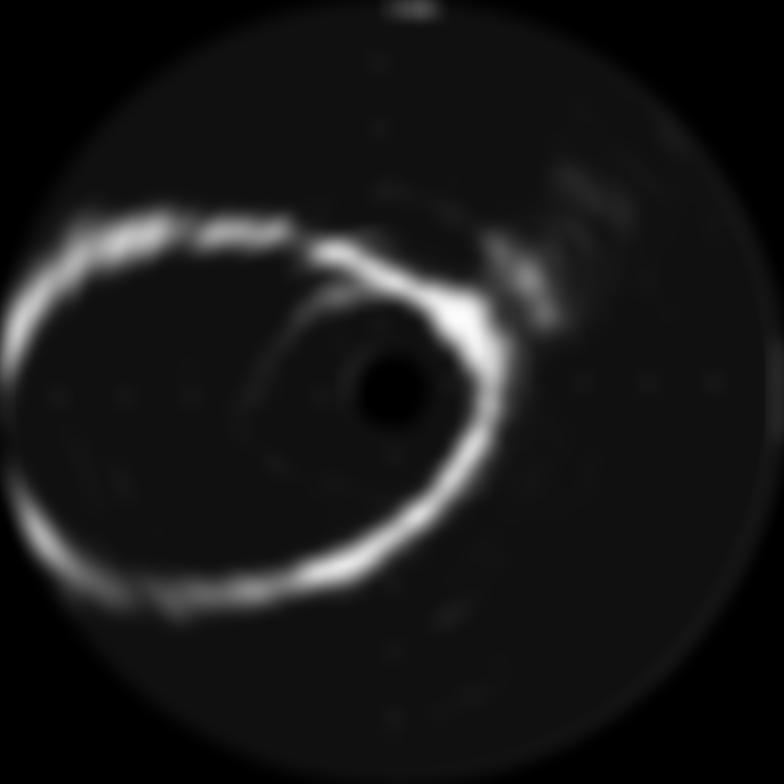
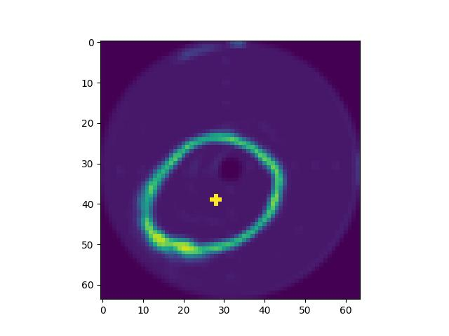
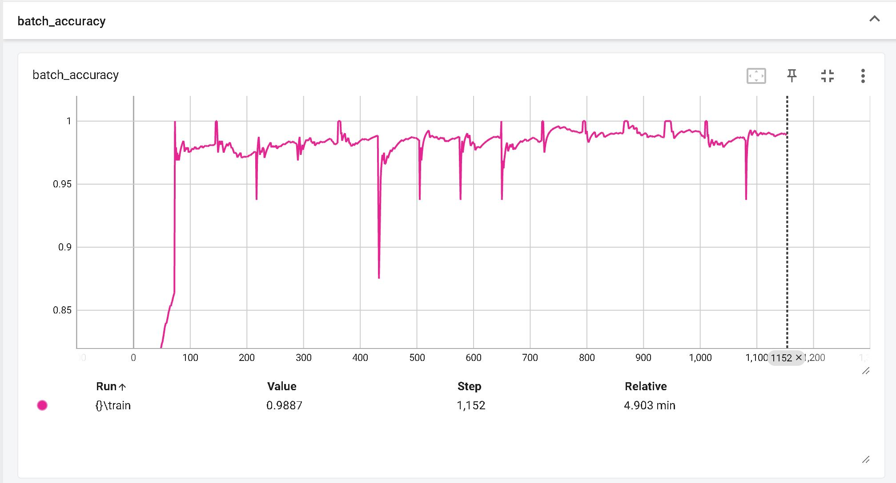
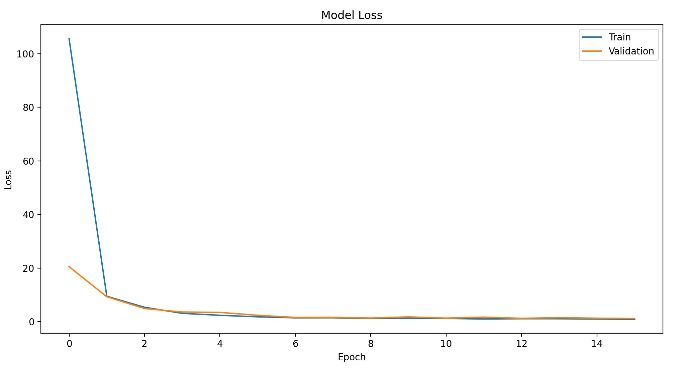

### Prerequisites
- Ensure you have tensorflow library installed for python
---
In your ubuntu terminal:
```Ruby
pip3 install tensorflow
```

### Machine Learning Model:
#### High Level Description:
The model employs a Convolutional Neural Network (CNN) designed to predict the centre 
coordinates of the aorta's cross-section based on processed images.


#### Processed Input Image:
The input image is preprocessed with:
- Gaussian blur applied with a 30x30 kernel, standard deviation of 10 in both 'x' and 'y' directions.
- Converted to greyscale (single channel)
- Circular masking to eliminate catheter and outer boundaries
- Square dimensions



### Internal:
- Input image resized to 64x64 pixels to optimise training speed and remove irrelevant details.

### Training data:
- Data is augmented via vertical and horizontal flips, expanding the 600 original samples to 1800
- 20% of the samples are reserved for validation as "unseen" test data
- Labels are human-generated and non-discrete, introducing potential for error and bias

### Results:
Example prediction:




Final model acurracy = 98.9%


